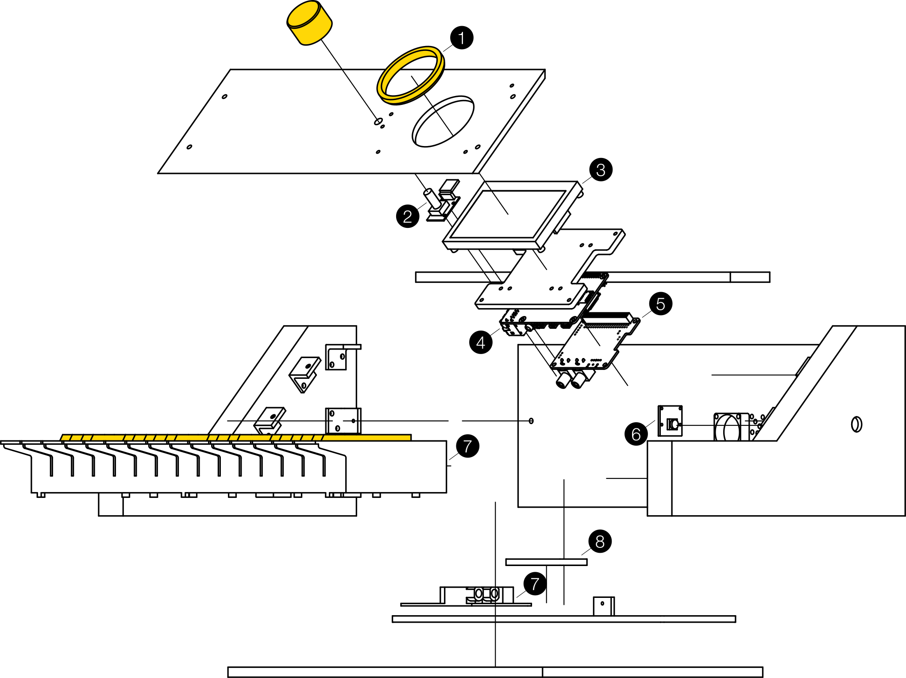

# Bottle Synth

My project for getting a bachelors degree [@digitalideation](https://github.com/digitalideation).
A synthesizer that generates sound with bottles. Built around a Raspberry Pi 4. 

## What? Why?
This project should offer a new way to engage with soundsynthesis. The synthesizer detects a bottle and changes it's timbre accoridingly to the type of bottle. For example a redwine bottle sounds pretty smooth and elegant. 
I did this because probably every musician sooner or later runs into a creative blockade (espacially if you only play one instrument like me). This synth should move you away from your normal workflow and make you look at soundsynthesis less as a combination of a bunch of knobs and more as a combination of a bunch of bottles.
  
## Hardware
The following are the basic hardware components used to build the synth. All the plans for making the enclosure can be found [here](./plans). You will also need some M3x16 skrews and 2.5M spacers.
1. Walimex Macrolens 58mm [buy](https://www.digitec.ch/de/s1/product/walimex-close-up-makrolinsen-set-58-mm-58mm-nahlinsen-objektivfilter-10380833)
2. HW-040 or KY-040 Rotary Encoder [buy](https://www.bastelgarage.ch/ky-040-rotary-encoder-drehgeber)
3. Waveshare 4.3“ DSI LCD [buy](https://www.waveshare.com/4.3inch-DSI-LCD.htm)
4. Raspberry Pi 4 4GB* [buy](https://www.pi-shop.ch/raspberry-pi-4-model-b-4gb)
5. Hifiberry DAC+ or DAC+ Zero* [buy](https://www.pi-shop.ch/hifiberry-dac-standard-rca-version) or [buy](https://www.pi-shop.ch/hifiberry-dac-zero)
6. Raspi Camera Module V2* [buy](https://www.pi-shop.ch/raspberry-pi-kamera-module-v2?src=raspberrypi)
7. Line 6 Mobile Keys 25 (not produced anymore) or Alesis Q25 (basicly the same keyboard) [buy](https://www.digitec.ch/de/s1/product/alesis-q25-keyboard-midi-controller-284712?gclsrc=ds&gclsrc=ds)
8. Coral Edge TPU* [buy](https://www.reichelt.com/ch/de/raspberry-pi-google-coral-usb-accelerator-rpi-ai-coral-usb-p287989.html?PROVID=2808&gclid=Cj0KCQjw8IaGBhCHARIsAGIRRYqpBNbpAIdwJT7OQ7U_1xyLwTbZ3i8aRYxOE1q2H8oiWCOW-OdGtxIaAlRMEALw_wcB)

*needed for basic functionality. You can also use different DACs or cameras.


## Installation 

1. First get the latest release of [Patchbox OS](https://blokas.io/patchbox-os/) and flash it to your SD card with a tool like [balenaEtcher](https://www.balena.io/etcher/)
2. Insert your SD card into the Raspberry Pi and follow the instructions of the installation wizard. Make sure you select installing PureData as a module and select the correct soundcard (hifiberry in my case). If you missed it you can rerun the wizard by issuing `patchbox` in the command line. If the soundcard isn't listed as an option, you'll have to modify the `/boot/config.txt` file. 
    ```bash 
    dtparam=audio=on #delete or comment this line out
    dtoverlay=hifiberry-dac #add the overlay of your soundcard (in this case for the hifiberry-dac)
    ```
    Reboot after that and rerun the wizard. 

3. Check if jack service is enabled and running
    ```bash
    sudo systemctl status jack
    ```
    if it's not active run
    ```bash
    sudo systemctl enable jack
    sudo systemctl start jack
    ```
4. Install the Edge TPU runtime by following this [guide](https://coral.ai/docs/accelerator/get-started/). Afterwards don't try to update the kernel, it will create problems with TPU runtime.
5. Clone this repo and install the requirements. This will install all dependencies needed.
    ```bash 
    git clone https://github.com/Dariush-Mehdiaraghi/bachelor_project && cd bachelor_project
    bash detection/install_requirements.sh
    ```
6. If you want to use the rotary encoder you will have to disable the `pisound-btn.service` 
    ```bash 
    sudo systemctl stop pisound-btn.service
    sudo systemctl disable pisound-btn.service
    ```

7. To start the pureData patch and the python script when the x server starts add those two lines to the `~/.xinitrc` file .
    ```bash 
    pd -noadc -nogui -jack -rt /home/patch/bachelor_project/pureDataPatch/Main.pd &
    python3 /home/patch/bachelor_project/detection/main.py
    ```
    Now you can start the synth by running
     ```bash 
    startx
    ```
    And stop it with
     ```bash 
    killall xinit
    ```
 9. If you want to start the synth automaticly after boot, modify the `/etc/rc.local` file to start the x server script. Make sure you insert it before `exit 0` and add the `&` at the end of the line so that the boot process can proceed.
    ```bash 
    su patch -c startx &
    exit 0
    ```
8. Connect a midikeyboard get some bottles and make music.

## Training
The synth is running a SSDmobiledet on the coral edge TPU.
The dataset and the jupiter notebook used for training can be found [here](./training).
